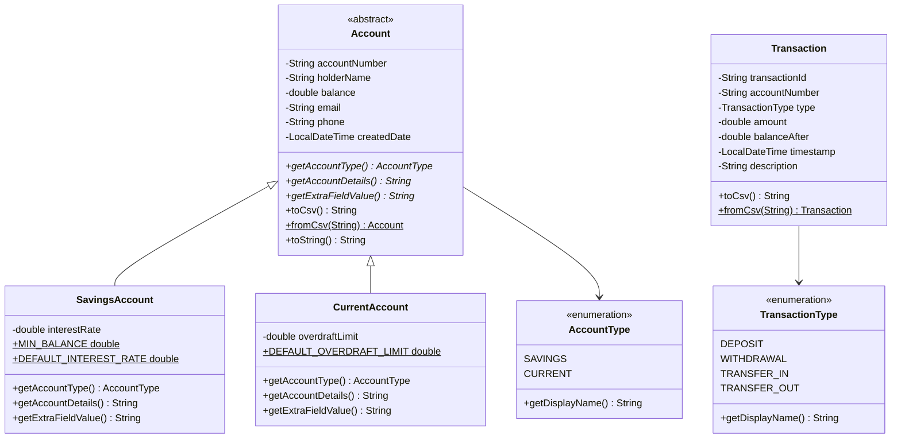
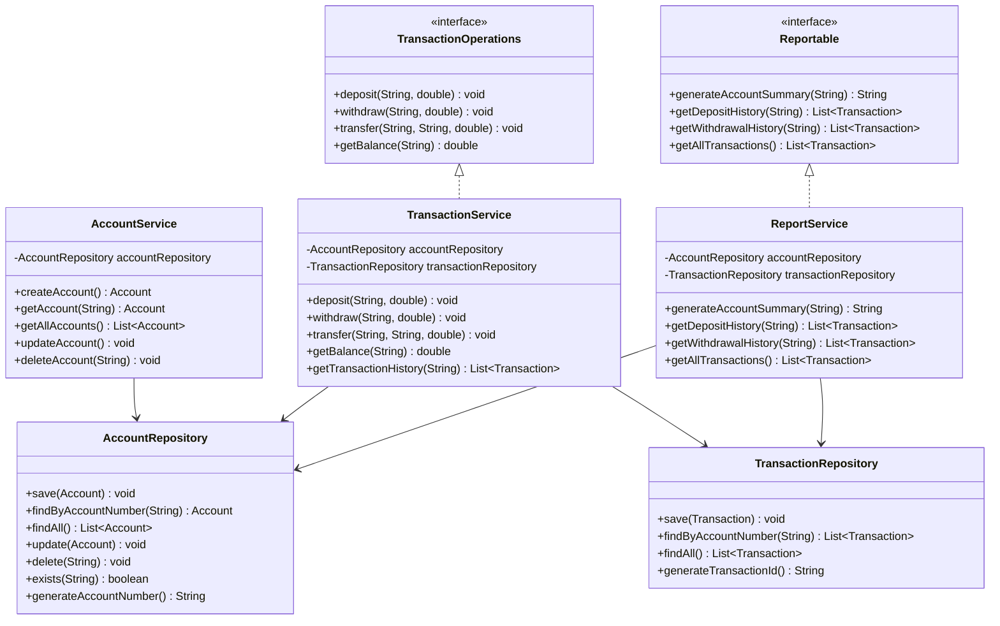
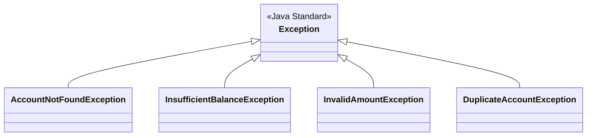

# Class Diagram

## Core Class Hierarchy

```mermaid
classDiagram
    class Account {
        <<abstract>>
        -String accountNumber
        -String holderName
        -double balance
        -String email
        -String phone
        -LocalDateTime createdDate
        +getAccountType()* AccountType
        +getAccountDetails()* String
        +getExtraFieldValue()* String
        +toCsv() String
        +fromCsv(String) Account$
        +toString() String
    }
    
    class SavingsAccount {
        -double interestRate
        +MIN_BALANCE double$
        +DEFAULT_INTEREST_RATE double$
        +getAccountType() AccountType
        +getAccountDetails() String
        +getExtraFieldValue() String
    }
    
    class CurrentAccount {
        -double overdraftLimit
        +DEFAULT_OVERDRAFT_LIMIT double$
        +getAccountType() AccountType
        +getAccountDetails() String
        +getExtraFieldValue() String
    }
    
    class Transaction {
        -String transactionId
        -String accountNumber
        -TransactionType type
        -double amount
        -double balanceAfter
        -LocalDateTime timestamp
        -String description
        +toCsv() String
        +fromCsv(String) Transaction$
    }
    
    class AccountType {
        <<enumeration>>
        SAVINGS
        CURRENT
        +getDisplayName() String
    }
    
    class TransactionType {
        <<enumeration>>
        DEPOSIT
        WITHDRAWAL
        TRANSFER_IN
        TRANSFER_OUT
        +getDisplayName() String
    }
    
    Account <|-- SavingsAccount
    Account <|-- CurrentAccount
    Account --> AccountType
    Transaction --> TransactionType
```

## Service and Repository Classes

```mermaid
classDiagram
    class TransactionOperations {
        <<interface>>
        +deposit(String, double) void
        +withdraw(String, double) void
        +transfer(String, String, double) void
        +getBalance(String) double
    }
    
    class Reportable {
        <<interface>>
        +generateAccountSummary(String) String
        +getDepositHistory(String) List~Transaction~
        +getWithdrawalHistory(String) List~Transaction~
        +getAllTransactions() List~Transaction~
    }
    
    class AccountService {
        -AccountRepository accountRepository
        +createAccount() Account
        +getAccount(String) Account
        +getAllAccounts() List~Account~
        +updateAccount() void
        +deleteAccount(String) void
    }
    
    class TransactionService {
        -AccountRepository accountRepository
        -TransactionRepository transactionRepository
        +deposit(String, double) void
        +withdraw(String, double) void
        +transfer(String, String, double) void
        +getBalance(String) double
        +getTransactionHistory(String) List~Transaction~
    }
    
    class ReportService {
        -AccountRepository accountRepository
        -TransactionRepository transactionRepository
        +generateAccountSummary(String) String
        +getDepositHistory(String) List~Transaction~
        +getWithdrawalHistory(String) List~Transaction~
        +getAllTransactions() List~Transaction~
    }
    
    class AccountRepository {
        +save(Account) void
        +findByAccountNumber(String) Account
        +findAll() List~Account~
        +update(Account) void
        +delete(String) void
        +exists(String) boolean
        +generateAccountNumber() String
    }
    
    class TransactionRepository {
        +save(Transaction) void
        +findByAccountNumber(String) List~Transaction~
        +findAll() List~Transaction~
        +generateTransactionId() String
    }
    
    TransactionOperations <|.. TransactionService
    Reportable <|.. ReportService
    AccountService --> AccountRepository
    TransactionService --> AccountRepository
    TransactionService --> TransactionRepository
    ReportService --> AccountRepository
    ReportService --> TransactionRepository
```

## Custom Exceptions

```mermaid
classDiagram
    class Exception {
        <<Java Standard>>
    }
    class AccountNotFoundException
    class InsufficientBalanceException
    class InvalidAmountException
    class DuplicateAccountException
    
    Exception <|-- AccountNotFoundException
    Exception <|-- InsufficientBalanceException
    Exception <|-- InvalidAmountException
    Exception <|-- DuplicateAccountException
```
