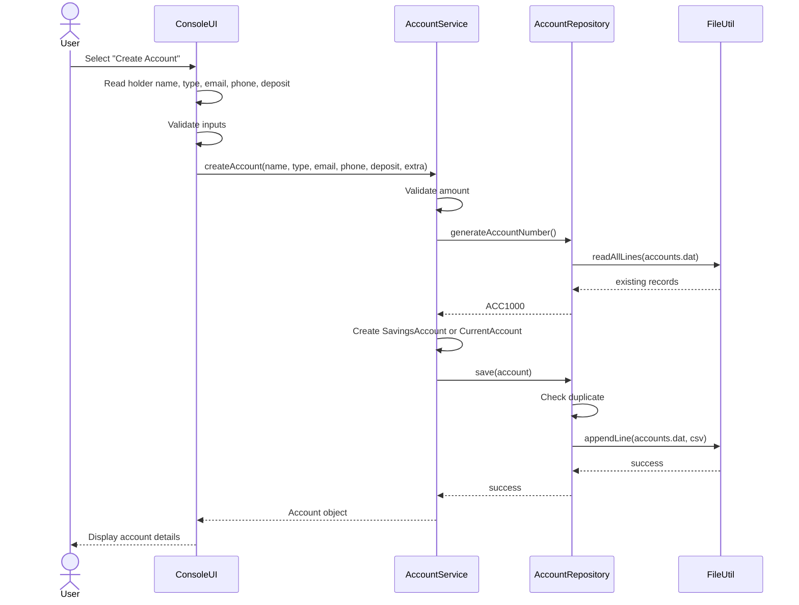
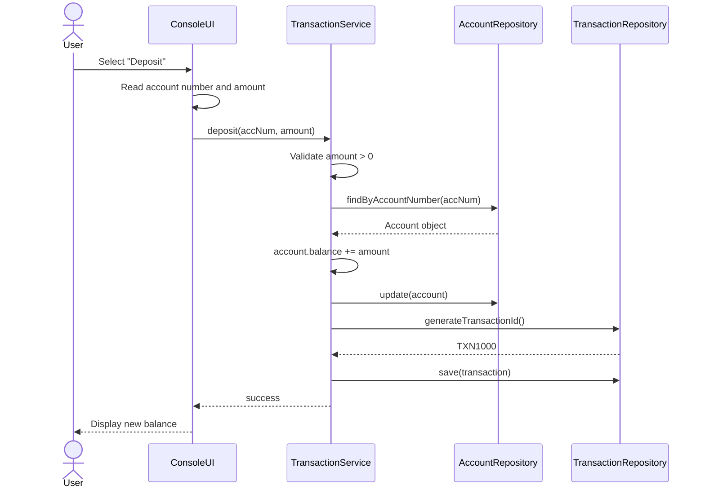
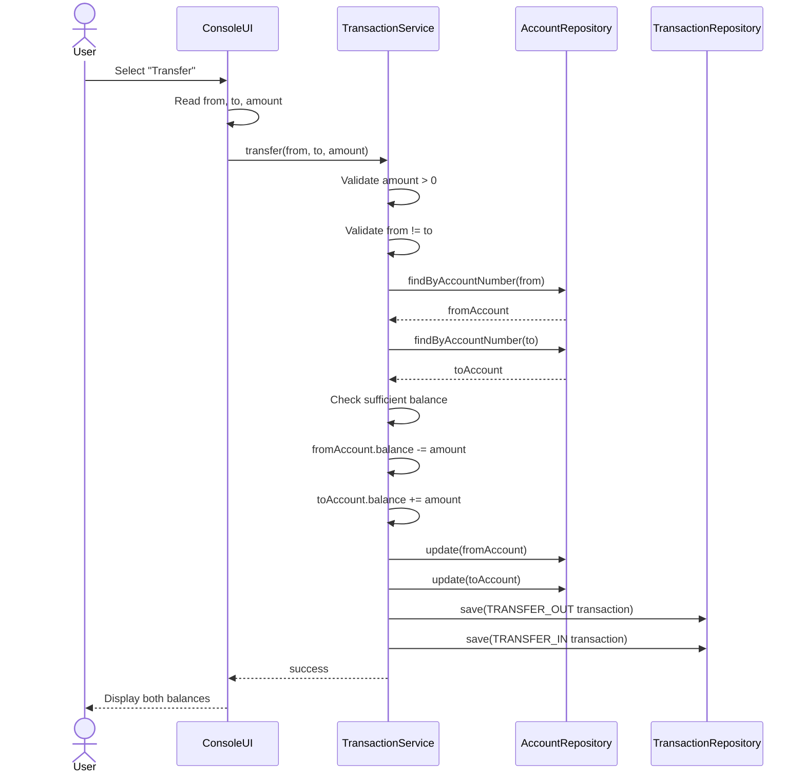
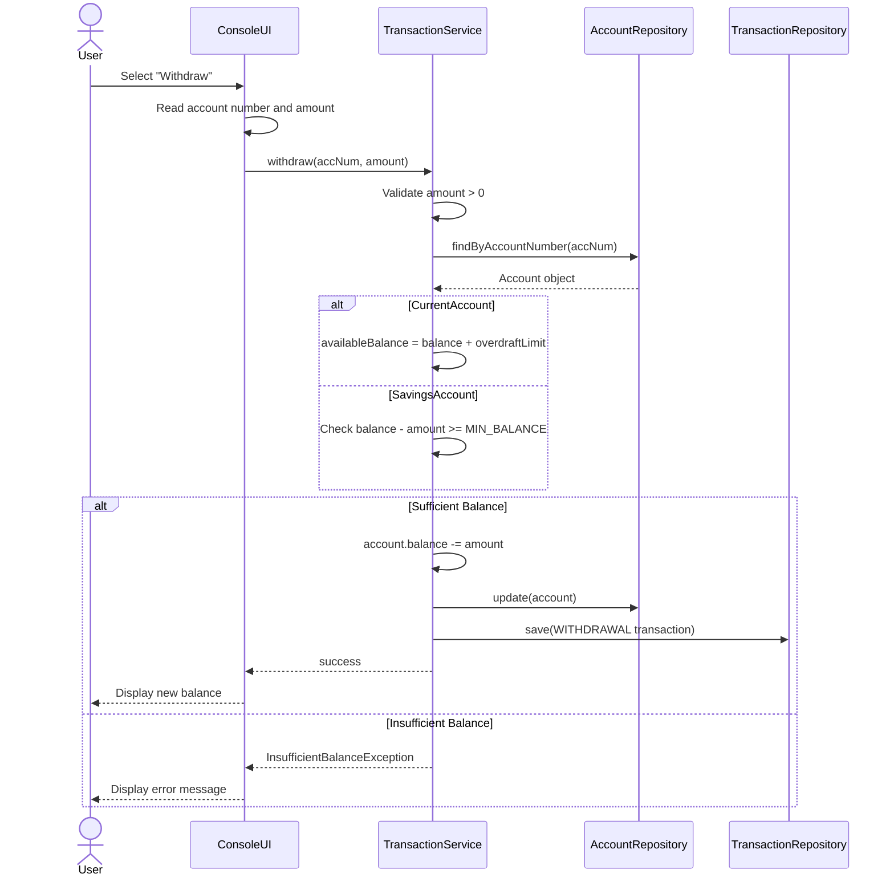

# Sequence Diagrams

## 1. Create Account

```mermaid
sequenceDiagram
    actor User
    participant UI as ConsoleUI
    participant AS as AccountService
    participant AR as AccountRepository
    participant FU as FileUtil

    User->>UI: Select "Create Account"
    UI->>UI: Read holder name, type, email, phone, deposit
    UI->>UI: Validate inputs
    UI->>AS: createAccount(name, type, email, phone, deposit, extra)
    AS->>AS: Validate amount
    AS->>AR: generateAccountNumber()
    AR->>FU: readAllLines(accounts.dat)
    FU-->>AR: existing records
    AR-->>AS: ACC1000
    AS->>AS: Create SavingsAccount or CurrentAccount
    AS->>AR: save(account)
    AR->>AR: Check duplicate
    AR->>FU: appendLine(accounts.dat, csv)
    FU-->>AR: success
    AR-->>AS: success
    AS-->>UI: Account object
    UI-->>User: Display account details
```

## 2. Deposit Money

```mermaid
sequenceDiagram
    actor User
    participant UI as ConsoleUI
    participant TS as TransactionService
    participant AR as AccountRepository
    participant TR as TransactionRepository

    User->>UI: Select "Deposit"
    UI->>UI: Read account number and amount
    UI->>TS: deposit(accNum, amount)
    TS->>TS: Validate amount > 0
    TS->>AR: findByAccountNumber(accNum)
    AR-->>TS: Account object
    TS->>TS: account.balance += amount
    TS->>AR: update(account)
    TS->>TR: generateTransactionId()
    TR-->>TS: TXN1000
    TS->>TR: save(transaction)
    TS-->>UI: success
    UI-->>User: Display new balance
```

## 3. Transfer Money

```mermaid
sequenceDiagram
    actor User
    participant UI as ConsoleUI
    participant TS as TransactionService
    participant AR as AccountRepository
    participant TR as TransactionRepository

    User->>UI: Select "Transfer"
    UI->>UI: Read from, to, amount
    UI->>TS: transfer(from, to, amount)
    TS->>TS: Validate amount > 0
    TS->>TS: Validate from != to
    TS->>AR: findByAccountNumber(from)
    AR-->>TS: fromAccount
    TS->>AR: findByAccountNumber(to)
    AR-->>TS: toAccount
    TS->>TS: Check sufficient balance
    TS->>TS: fromAccount.balance -= amount
    TS->>TS: toAccount.balance += amount
    TS->>AR: update(fromAccount)
    TS->>AR: update(toAccount)
    TS->>TR: save(TRANSFER_OUT transaction)
    TS->>TR: save(TRANSFER_IN transaction)
    TS-->>UI: success
    UI-->>User: Display both balances
```

## 4. Withdraw Money

```mermaid
sequenceDiagram
    actor User
    participant UI as ConsoleUI
    participant TS as TransactionService
    participant AR as AccountRepository
    participant TR as TransactionRepository

    User->>UI: Select "Withdraw"
    UI->>UI: Read account number and amount
    UI->>TS: withdraw(accNum, amount)
    TS->>TS: Validate amount > 0
    TS->>AR: findByAccountNumber(accNum)
    AR-->>TS: Account object
    
    alt CurrentAccount
        TS->>TS: availableBalance = balance + overdraftLimit
    else SavingsAccount
        TS->>TS: Check balance - amount >= MIN_BALANCE
    end
    
    alt Sufficient Balance
        TS->>TS: account.balance -= amount
        TS->>AR: update(account)
        TS->>TR: save(WITHDRAWAL transaction)
        TS-->>UI: success
        UI-->>User: Display new balance
    else Insufficient Balance
        TS-->>UI: InsufficientBalanceException
        UI-->>User: Display error message
    end
```
