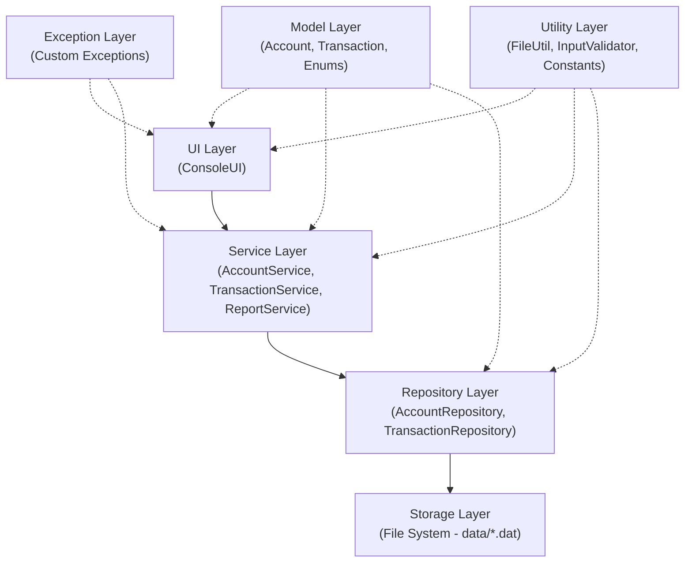
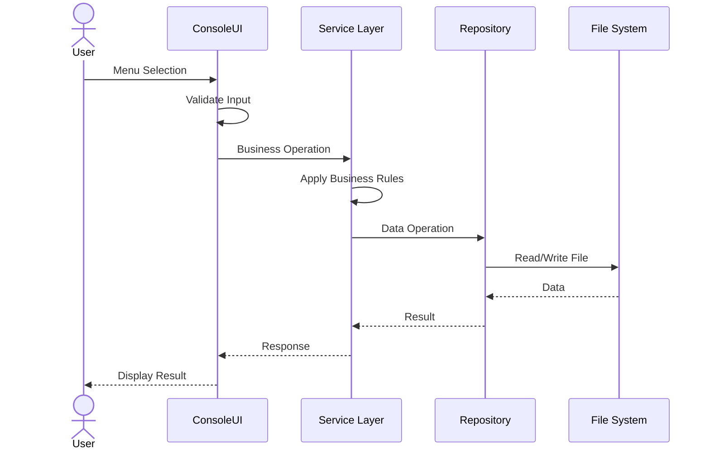

# System Architecture

## Overview

SmartBank follows a **layered architecture** pattern with clear separation of concerns. The system is divided into four main layers:

## Layer Description

### 1. UI Layer (`com.smartbank.ui`)
- Handles all user interaction
- Displays menus and reads user input
- Delegates business logic to the Service Layer
- Catches and displays exceptions

### 2. Service Layer (`com.smartbank.service`)
- Contains all business logic
- Validates business rules
- Coordinates between UI and Repository layers
- Implements interfaces (TransactionOperations, Reportable)

### 3. Repository Layer (`com.smartbank.repository`)
- Manages data persistence
- Handles file read/write operations
- Provides CRUD operations for entities
- Abstracts file storage details from the service layer

### 4. Storage Layer (File System)
- Uses pipe-delimited text files for data storage
- `data/accounts.dat` - stores account records
- `data/transactions.dat` - stores transaction records
- Data persists across application restarts

### 5. Model Layer (`com.smartbank.model`)
- Defines data structures (POJOs)
- Contains abstract class (Account) and concrete implementations
- Includes enums for type safety
- Provides serialization/deserialization methods

### 6. Exception Layer (`com.smartbank.exception`)
- Custom checked exceptions for business error handling
- Provides meaningful error messages

### 7. Utility Layer (`com.smartbank.util`)
- Helper classes for common operations
- File I/O utilities, input validation, constants

## Data Flow

