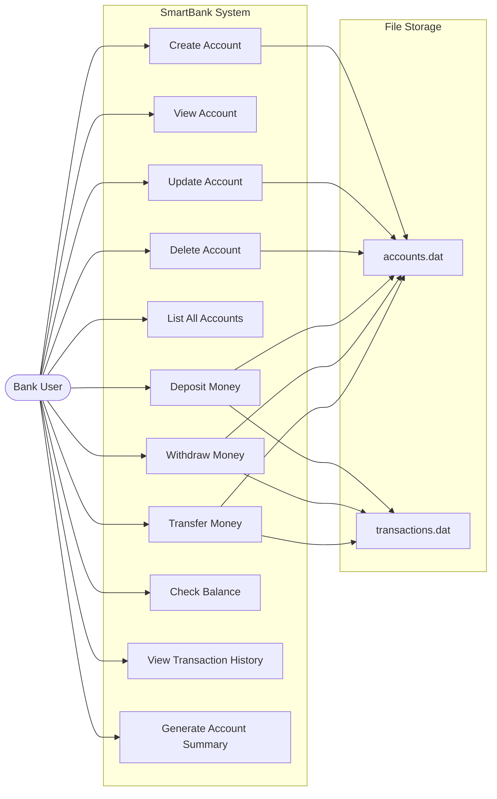

# Use Case Diagram

## System Use Cases

## Use Case Descriptions

| Use Case | Actor | Description | Precondition | Postcondition |
|---|---|---|---|---|
| Create Account | User | Creates a new Savings or Current account | Valid input data | Account saved to file |
| View Account | User | Displays detailed account information | Account exists | Account details shown |
| Update Account | User | Modifies account holder details | Account exists | Updated data saved |
| Delete Account | User | Removes an account | Account exists, user confirms | Account removed from file |
| List All Accounts | User | Shows all accounts in table format | None | All accounts displayed |
| Deposit Money | User | Adds money to an account | Account exists, amount > 0 | Balance increased, transaction recorded |
| Withdraw Money | User | Removes money from an account | Account exists, sufficient balance | Balance decreased, transaction recorded |
| Transfer Money | User | Moves money between accounts | Both accounts exist, sufficient balance | Balances updated, transactions recorded |
| Check Balance | User | Shows current account balance | Account exists | Balance displayed |
| View History | User | Shows transaction history | Account exists | Transactions listed |
| Account Summary | User | Generates comprehensive report | Account exists | Summary report displayed |
