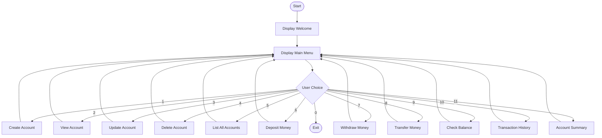
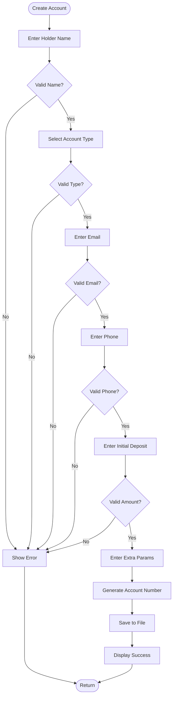
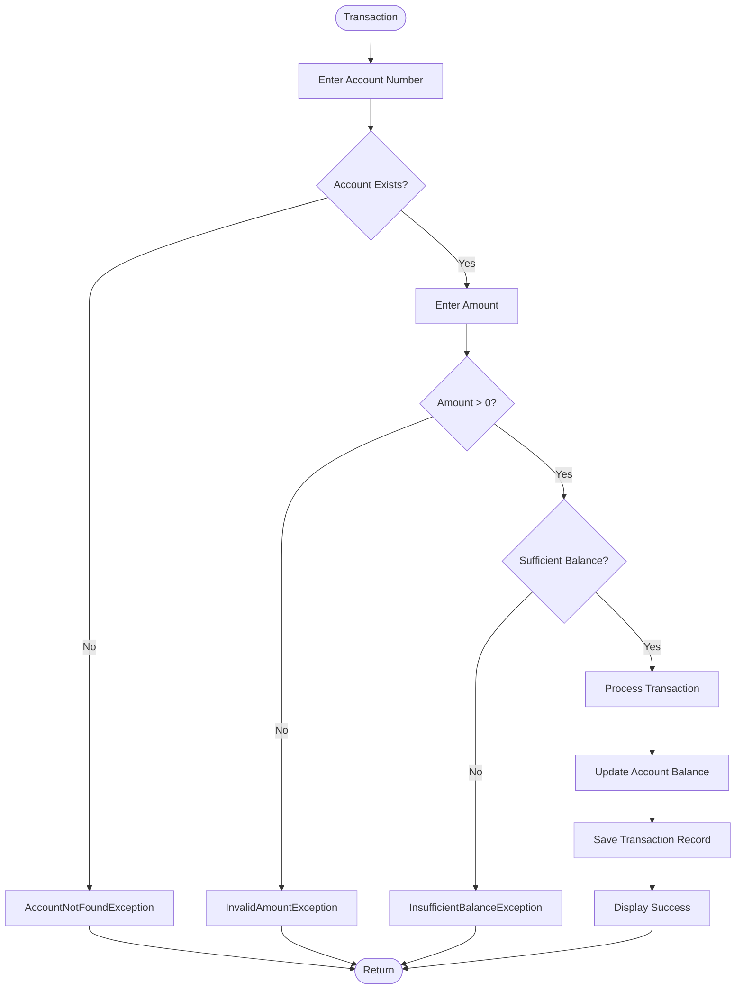

# Application Workflow

## Main Application Flow

```mermaid
flowchart TD
    A([Start]) --> B[Display Welcome]
    B --> C[Display Main Menu]
    C --> D{User Choice}
    
    D -->|1| E[Create Account]
    D -->|2| F[View Account]
    D -->|3| G[Update Account]
    D -->|4| H[Delete Account]
    D -->|5| I[List All Accounts]
    D -->|6| J[Deposit Money]
    D -->|7| K[Withdraw Money]
    D -->|8| L[Transfer Money]
    D -->|9| M[Check Balance]
    D -->|10| N[Transaction History]
    D -->|11| O[Account Summary]
    D -->|0| P([Exit])
    
    E --> C
    F --> C
    G --> C
    H --> C
    I --> C
    J --> C
    K --> C
    L --> C
    M --> C
    N --> C
    O --> C
```

## Account Creation Workflow

```mermaid
flowchart TD
    A([Create Account]) --> B[Enter Holder Name]
    B --> C{Valid Name?}
    C -->|No| D[Show Error] --> Z([Return])
    C -->|Yes| E[Select Account Type]
    E --> F{Valid Type?}
    F -->|No| D
    F -->|Yes| G[Enter Email]
    G --> H{Valid Email?}
    H -->|No| D
    H -->|Yes| I[Enter Phone]
    I --> J{Valid Phone?}
    J -->|No| D
    J -->|Yes| K[Enter Initial Deposit]
    K --> L{Valid Amount?}
    L -->|No| D
    L -->|Yes| M[Enter Extra Params]
    M --> N[Generate Account Number]
    N --> O[Save to File]
    O --> P[Display Success]
    P --> Z
```

## Transaction Workflow

```mermaid
flowchart TD
    A([Transaction]) --> B[Enter Account Number]
    B --> C{Account Exists?}
    C -->|No| D[AccountNotFoundException] --> Z([Return])
    C -->|Yes| E[Enter Amount]
    E --> F{Amount > 0?}
    F -->|No| G[InvalidAmountException] --> Z
    F -->|Yes| H{Sufficient Balance?}
    H -->|No| I[InsufficientBalanceException] --> Z
    H -->|Yes| J[Process Transaction]
    J --> K[Update Account Balance]
    K --> L[Save Transaction Record]
    L --> M[Display Success]
    M --> Z
```
